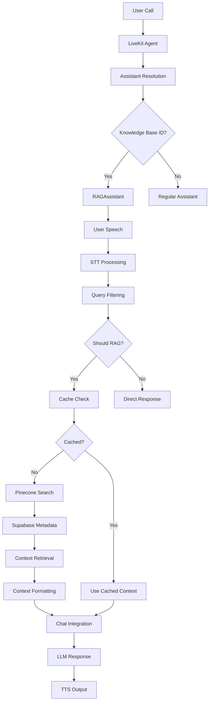

# RAG System Architecture

## System Overview

Your LiveKit voice agent integrates with a sophisticated RAG (Retrieval-Augmented Generation) system using Pinecone and Supabase.

## Architecture Diagram

## Component Details

### 1. RAG Service (`rag_service.py`)
- **Pinecone Integration**: Uses Pinecone Assistants API for semantic search
- **Supabase Integration**: Retrieves knowledge base metadata
- **Context Processing**: Formats snippets with source attribution
- **Caching**: Implements query result caching
- **Deduplication**: Removes duplicate snippets

### 2. RAG Assistant (`rag_assistant.py`)
- **Automatic RAG**: Triggers on user turn completion
- **Smart Filtering**: Avoids unnecessary queries
- **Tool Integration**: Provides `search_knowledge` and `get_detailed_info`
- **Context Management**: Handles context length limits (8000 chars)
- **State Management**: Tracks RAG queries and context

### 3. Main Integration (`main.py`)
- **Dynamic Selection**: Chooses RAG vs regular assistant based on knowledge_base_id
- **Configuration**: Retrieves knowledge base ID from agent config
- **Tool Registration**: Adds RAG tools to conversation flow
- **Environment Setup**: Configures Pinecone and Supabase clients

## Data Flow

### Query Processing
1. **User Input**: Speech → STT → Text
2. **Filtering**: Check if query needs RAG lookup
3. **Caching**: Check if result is cached
4. **Search**: Query Pinecone Assistants API
5. **Context**: Format and integrate context
6. **Response**: Generate LLM response with context

### Context Retrieval
1. **Knowledge Base Lookup**: Get KB info from Supabase
2. **Assistant Generation**: Create Pinecone assistant name
3. **Semantic Search**: Query with top_k=16, snippet_size=2048
4. **Result Processing**: Format snippets with metadata
5. **Length Management**: Respect max_context_length limits

## Performance Characteristics

### Current Performance
- ✅ **Context Retrieval**: ~975 characters per query
- ✅ **Snippet Quality**: High relevance scores (0.7+)
- ✅ **Caching**: Effective cache utilization
- ⚠️ **TTS Latency**: Silero inference slower than realtime (2+ seconds)

### Optimization Opportunities
1. **TTS Performance**: Consider faster TTS models
2. **Context Length**: Optimize snippet size vs relevance
3. **Query Frequency**: Fine-tune filtering thresholds
4. **Caching Strategy**: Implement more sophisticated caching

## Configuration

### Environment Variables
- `PINECONE_API_KEY`: Pinecone API key
- `SUPABASE_URL`: Supabase project URL
- `SUPABASE_SERVICE_ROLE_KEY`: Supabase service role key
- `OPENAI_API_KEY`: OpenAI API key for LLM/STT/TTS

### Agent Configuration
- `knowledge_base_id`: Links agent to specific knowledge base
- `company_id`: Used for Pinecone assistant naming
- `max_context_length`: Maximum context size (default: 8000)
- `rag_threshold`: Minimum relevance score (default: 0.3)

## Tools Available

### Automatic RAG Tools
- **Context Retrieval**: Automatic on user turns
- **Smart Filtering**: Avoids redundant queries
- **Cache Management**: Efficient result caching

### Manual RAG Tools
- **search_knowledge**: Direct knowledge base search
- **get_detailed_info**: Multi-query detailed information retrieval

## Error Handling

### Graceful Degradation
- **Pinecone Unavailable**: Falls back to regular assistant
- **Supabase Unavailable**: Logs warning, continues without RAG
- **Context Retrieval Failure**: Returns helpful error message
- **Cache Miss**: Performs fresh search

### Logging
- **RAG_SERVICE**: Service-level operations
- **RAG_ASSISTANT**: Assistant-level operations
- **Context Retrieval**: Search and formatting details
- **Performance**: Timing and optimization metrics
